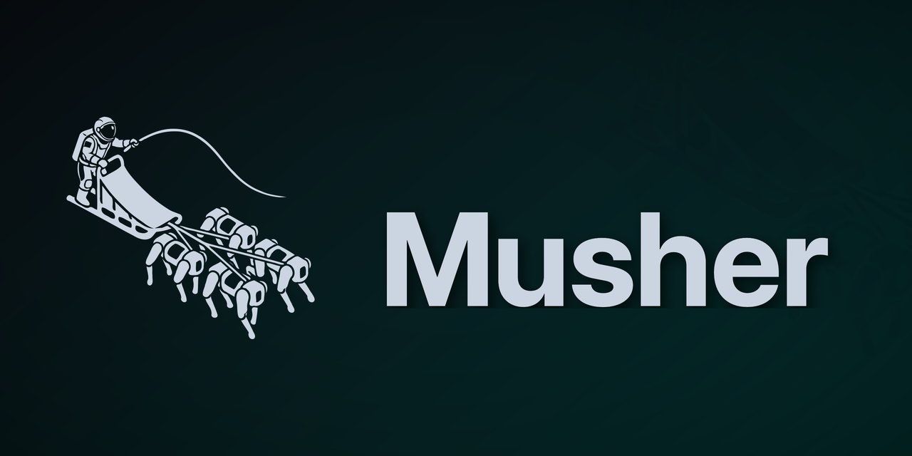

<!-- markdownlint-disable MD033 MD041 -- GitHub profile layout: a centered banner needs inline HTML. -->

  

  <strong>The Infrastructure of Execution.</strong> 
  Musher runs agent stacks: the workflow engines, model gateways, vector stores and chat tools you wire together so
  software can act on your behalf.

  <a href="https://musher.dev">Website</a> &middot;
  <a href="https://docs.musher.dev">Docs</a> &middot;
  <a href="https://discord.gg/SaVMzMgX2c">Discord</a> &middot;
  <a href="https://x.com/musherdev">X</a>

